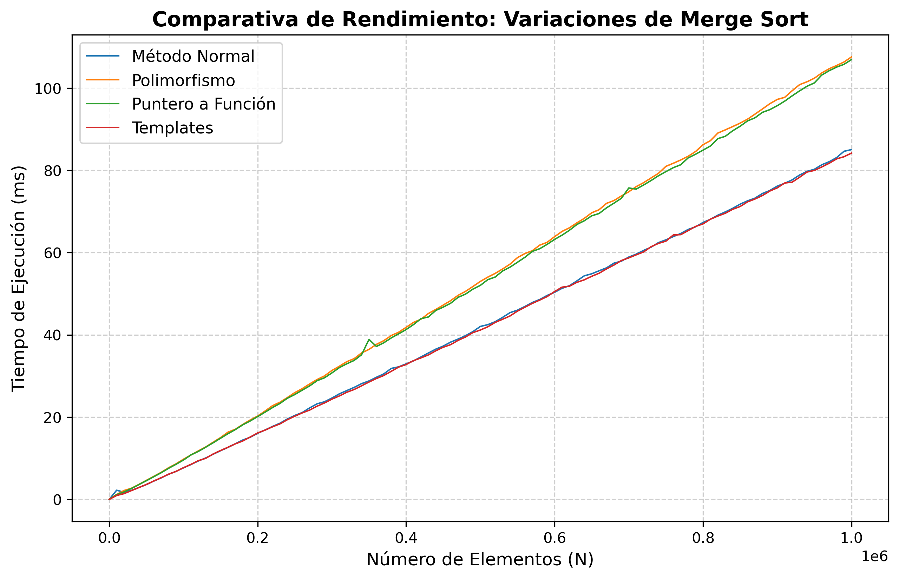

## 📊 Comparación de Rendimiento: Variaciones de Merge Sort

Este proyecto analiza el impacto en el rendimiento del algoritmo **Merge Sort** al implementar tres variantes distintas en C++ para ordenar arreglos dinámicos.

### 🔍 Métodos Comparados

- **Método Normal:** Implementación directa con funciones nativas. Permite al compilador aplicar máximas optimizaciones en tiempo de compilación.
- **Polimorfismo:** Uso de clases abstractas y estructuras de comparación virtuales. Introduce una sobrecarga debido a la búsqueda en la tabla de funciones virtuales (_vtable_).
- **Puntero a Función:** Paso dinámico de la lógica de ordenamiento a través de punteros a función tradicionales.
- **Templates (Plantillas):** Uso de plantillas para mejor optimización.

---

## 🛠️ Guía de Uso

### Requisitos Previos

- **Compilador de C++** (compatible con C++11 o superior, como `g++`).
- **Intérprete de Python 3** (con las librerías `pandas` y `matplotlib` instaladas).

### Pasos para Ejecutar el Proyecto

Sigue estos pasos en tu terminal para compilar el benchmark y generar las métricas:

1. **Compilar el código fuente:**
   Genera el archivo ejecutable compilando el código en c++.
2. **Ejecuta el ejecutable.**
   Ahora ejecuta tu archivo y verás una tabla de comparación.

```bash
===========================================================================================
ELEMENTOS      M. NORMAL (ms)    POLIMORFISMO (ms)     PUNT. FUNC (ms)   TEMPLATES (ms)
-------------------------------------------------------------------------------------------
1              0.000459          0.000198              0.000198          0.0003
10001          1.97567           1.7073                1.14836           0.950779
20001          2.67098           2.99625               1.97369           1.3831
30001          2.19394           2.72452               2.67341           2.14773
40001          2.88172           3.74019               3.5674            2.88241
50001          3.63812           4.67248               4.5947            3.67269
60001          4.49198           5.54109               5.53448           4.43354
70001          5.27785           6.66611               6.67063           5.38511
80001          6.29954           7.99484               7.74254           6.20371
90001          6.95092           8.66523               8.60201           6.92875
100001         7.58978           9.70924               9.55431           7.60766
110001         8.41499           10.6719               10.6125           8.36853
120001         9.28129           11.8232               11.6483           9.29088
130001         10.2392           12.7809               12.6291           10.0636
140001         11.1209           14.2366               13.863            11.0918
150001         11.9039           15.199                15.2367           11.976
...
```

1. **Genera la gráfica.**
   Ejecuta el script de Python para procesar el CSV y renderizar las curvas de rendimiento.
   
